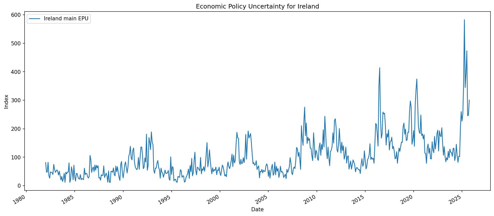

## Irish Economic Policy Uncertainty data

This page provides the data that underpin my work on Irish economic policy uncertainty, including the paper *Economic Policy Uncertainty Shocks in Small Open Economies: A Case Study of Ireland*.

The series are hosted externally by the Economic Policy Uncertainty project and are mirrored here for convenience.

### Download

[Download the Ireland Economic Policy Uncertainty dataset (Excel)](files/ireland-epu-index.xlsx)

### What is in the file

The Excel file contains monthly observations with three columns.

- `Date`  
  Month identifier (recorded as the first day of each month).

- `Ireland_main_epu`  
  A newspaper-based index of Irish Economic Policy Uncertainty.

- `Ireland_domestic_epu`  
  An orthogonal domestic component of Irish EPU, constructed by purging the main series of its global component (see the construction notes below).

### Construction overview

Following the newspaper-based approach in Baker, Bloom and Davis (2016), I construct a monthly measure of Irish Economic Policy Uncertainty from January 1982 onwards using newspaper archives from two leading Irish newspapers, *The Irish Times* and the *Irish Independent*.

The index is built from a keyword search that identifies articles containing terms related to uncertainty, the economy, and policy. Monthly article counts are scaled by the total number of articles in each month and then standardised.

To separate domestic from global influences, I estimate a global component of policy uncertainty using principal components analysis and then obtain an orthogonal Irish domestic series via regression.

### Chart

{fig-alt="Irish Economic Policy Uncertainty indices, main and domestic components"}

### Paper and documentation

- External data page: [Link](https://www.policyuncertainty.com/ireland_rice.html)  
- Journal version of the paper: [Link](https://www.esr.ie/article/view/2531)  
- Working paper version: [Link](https://www.centralbank.ie/docs/default-source/publications/research-technical-papers/01rt20-economic-policy-uncertainty-in-small-open-economies-a-case-study-of-ireland-%28rice%29.pdf?sfvrsn=4)

### Suggested citation

If you use these data, please cite the journal article as follows: Rice, Jonathan (2023). "Economic Policy Uncertainty Shocks in Small Open Economies: A Case Study of Ireland". The Economic and Social Review, 54(4), 217-245.
