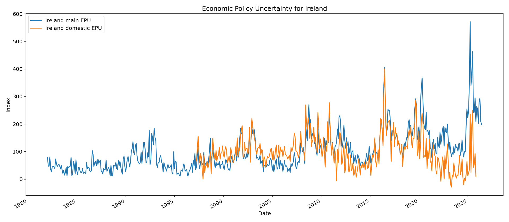

## Irish Economic Policy Uncertainty data

This page provides the data that underpin my work on Irish economic policy uncertainty, including the paper *Economic Policy Uncertainty Shocks in Small Open Economies: A Case Study of Ireland*. I aim to keep the series as up-to-date as possible.

**Latest mirrored update:** 25 June 2026. The main EPU series is updated through June 2026 using data through 25 June; the domestic component is updated through November 2025, reflecting the latest available all-country input panel used for the domestic-series estimation.

### Download

[Download the Ireland Economic Policy Uncertainty dataset (Excel)](files/ireland-epu-index.xlsx)

### What is in the file

The Excel file contains monthly observations with three columns.

- `Date`  
  Month identifier (recorded as the first day of each month).

- `Ireland_main_epu`  
  A newspaper-based index of Irish Economic Policy Uncertainty. This is the headline series and is available monthly from January 1982.

- `Ireland_domestic_epu`  
  An orthogonal domestic component of Irish EPU, constructed by purging the main series of its global component. This series is used in the paper to consider the impact of local/domestic uncertainty shocks.

### Construction overview

Following the newspaper-based approach in Baker, Bloom and Davis (2016), I construct a monthly measure of Irish Economic Policy Uncertainty from January 1982 onwards using newspaper archives from leading Irish newspapers, including *The Irish Times*, *The Irish Independent* and *The Irish Examiner*.

The index is built from a keyword search that identifies articles containing terms related to uncertainty, the economy, and policy. Monthly article counts are scaled by the total number of articles in each month and then standardised.

To separate domestic from global influences, I estimate a global component of policy uncertainty using principal components analysis and then obtain an orthogonal Irish domestic series via regression.

### Chart

{fig-alt="Irish Economic Policy Uncertainty indices, main and domestic components"}

### Paper and documentation

- External data page, https://www.policyuncertainty.com/ireland_rice.html  
- Journal article landing page, https://www.esr.ie/article/view/2531  
- Working paper version, https://www.centralbank.ie/docs/default-source/publications/research-technical-papers/01rt20-economic-policy-uncertainty-in-small-open-economies-a-case-study-of-ireland-%28rice%29.pdf?sfvrsn=4

If you use these data, please cite the journal article or the working paper above, depending on whether you are referencing the empirical results or the construction details.
